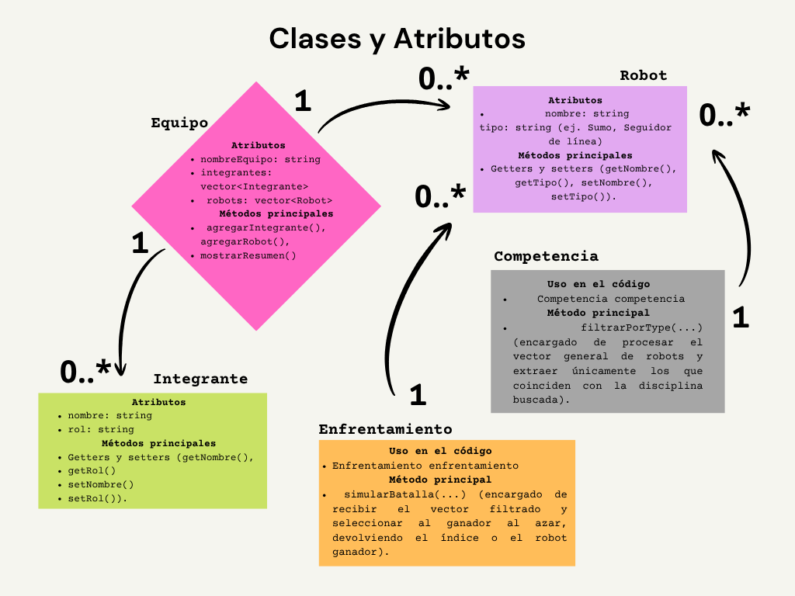

# Sistema de Gestión de Competencia de Robótica en C++ — Parcial 1

Proyecto de desarrollo orientado a objetos (POO) — Mecatrónica, 3er semestre, La Salle Saltillo.

Cubre la arquitectura y el flujo completo para la gestión de equipos, robots, integrantes, filtrado por disciplinas y simulación de batallas:

1. Clases `Robot`, `Integrante`, `Equipo`, `Competencia` y `Enfrentamiento` — sintaxis estructurada, separación `.h`/`.cpp`, include guards (`#pragma once`)
2. Constructores con listas de inicialización
3. Getters y setters con diseño orientado a objetos
4. Composición: `Equipo` contiene `vector<Integrante>` y `vector<Robot>`
5. `std::vector`: carga de elementos y filtrado de robots por tipo a través de la clase `Competencia`
6. Entrada/salida: captura interactiva de un `Equipo` completo por consola
7. `<random>`: simulación de batallas aleatorias mediante la clase `Enfrentamiento`
8. Buenas prácticas: `const` correctness, paso por referencia constante, organización modular de archivos


### Diagrama de clases

<p align="center">
  
</p>


## Estructura

```
Gestion_Competencia_Robotica/
├── include/          # Archivos .h (declaraciones / interfaz)
│   ├── Robot.h
│   ├── Integrante.h
│   ├── Equipo.h
│   └── Competencia.h
    └── Enfrentamiento.h
├── src/              # Archivos .cpp (implementación)
│   ├── Robot.cpp
│   ├── Integrante.cpp
│   ├── Equipo.cpp
│   ├── Competencia.cpp
    └──Enfrentamiento.cpp
│   └── main.cpp
├── Makefile
└── README.md
```

## Compilar y correr

### Windows / macOS / Linux (con `g++` en el PATH)

```bash
make run
```

O manualmente:

```bash
g++ -std=c++17 -Wall -Iinclude src/*.cpp -o gestionCompetencia
./demo        # macOS/Linux
demo.exe      # Windows
```

### Sin `make` (por ejemplo, usando la extensión de C++ de VSCode)

Compilar todos los `.cpp` de `src/` agregando `include/` como carpeta de headers (`-I include`).

## Qué esperar al correrlo

El programa, tal como está, hace lo siguiente automáticamente:

1. Carga 5 robots de ejemplo (`vector<Robot>`)
2. Filtra los robots de tipo `"Sumo"`
3. Simula una batalla aleatoria entre dos robots y anuncia un ganador

El bloque de **captura interactiva de un `Equipo`** y el **mini-reto integrador** están comentados
al final de `main.cpp` — se descomentan en clase para practicar `cin`/`getline` y unir todas las
piezas (`Equipo` + `Robot` + `vector` + batalla) en un solo flujo.

## Buenas prácticas aplicadas (para señalar en clase)

- Include guards (`#pragma once`) en todos los `.h`
- Separación interfaz (`.h`) / implementación (`.cpp`)
- Listas de inicialización en constructores
- Parámetros `std::string` recibidos por referencia constante (`const std::string&`)
- Métodos que no modifican estado marcados `const`
- `const auto&` en recorridos `range-based for`
- `<random>` (`mt19937` + `uniform_int_distribution`) en vez de `rand()`

