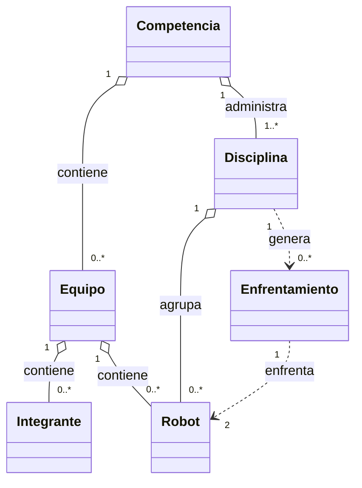

# Sistema de Gestión de Competencia de Robótica en C++

Proyecto orientado a objetos para gestionar una competencia de robotica estudiantil para estudiantes de ingenieria. Solo participan las carreras INGENIERIA MECATRONICA, INGENIERIA INDUSTRIAL e INGENIERIA AMBIENTAL.

## Descripción general

Este proyecto modela una competencia en la que:

1. Se crean equipos con nombre, integrantes y robots.
2. Cada robot pertenece a una disciplina: `SUMO`, `SEGUIDOR DE LINEA` o `VELOCISTA`.
3. La competencia valida el registro, cierra la fase de inscripción y genera enfrentamientos por disciplina.
4. Se ejecutan batallas aleatorias y se presenta un reporte final con los resultados.

La competencia permite un maximo de 10 equipos y cada equipo puede registrar como maximo 2 robots. Los nombres de equipos, integrantes y robots no pueden repetirse. Los textos registrados se convierten a MAYUSCULAS y se normalizan sin acentos.

El desarrollo está organizado con separación entre interfaz y lógica, usando clases propias para cada entidad del dominio.

### Diagrama de clases

<p align="center">
  
</p>

### Identificacion de clases y relaciones

Las clases del sistema colaboran mediante llamadas a sus metodos y no utilizan herencia:

- `Competencia`: administra el nombre, el estado, los equipos y las disciplinas. Registra equipos, cierra el registro, clasifica robots y genera los enfrentamientos.
- `Equipo`: representa un equipo y contiene integrantes y robots.
- `Integrante`: representa a una persona del equipo con nombre y carrera.
- `Robot`: representa un robot con nombre y tipo de disciplina.
- `Disciplina`: agrupa robots del mismo tipo, genera enfrentamientos y almacena sus resultados.
- `Enfrentamiento`: simula la competencia entre dos robots y determina el ganador.

Relaciones principales:

- Una `Competencia` contiene cero o varios `Equipo`.
- Un `Equipo` contiene cero o varios `Integrante` y cero o varios `Robot`.
- Una `Competencia` contiene las disciplinas disponibles.
- Una `Disciplina` agrupa robots del mismo tipo y genera enfrentamientos.
- Un `Enfrentamiento` recibe dos `Robot` para simular la competencia.



## Estructura del proyecto

```text
Equipo-2/
├── include/                         # Declaraciones de clases
│   ├── Competencia.h
│   ├── Disciplina.h
│   ├── Enfrentamiento.h
│   ├── Equipo.h
│   ├── Integrante.h
│   └── Robot.h
├── src/                            # Implementación de las clases
│   ├── Competencia.cpp
│   ├── Disciplina.cpp
│   ├── Enfrentamiento.cpp
│   ├── Equipo.cpp
│   ├── Integrante.cpp
│   ├── Robot.cpp
│   └── main.cpp
├── build/                          # Archivo compilado generado por el proyecto
├── README.md
└── Diagrama_de_Clases_Atributos.png
```

## Clases principales

- `Robot`: representa a cada robot participante y almacena su nombre y tipo.
- `Integrante`: almacena los datos de cada integrante del equipo.
- `Equipo`: compone a un equipo con varios integrantes y varios robots.
- `Disciplina`: agrupa robots por tipo y organiza sus enfrentamientos.
- `Enfrentamiento`: simula la batalla entre dos robots.
- `Competencia`: administra el estado de la competencia, registra equipos y genera reportes finales.

## Compilar y correr

### En Windows

Ejecuta el programa compilado:

```powershell
.\build\gestionRobots.exe
```

### En macOS

Ejecuta el programa compilado:

```bash
./build/gestionRobots
```

## Qué esperar al correrlo

Al ejecutar el programa, la aplicación se comporta de la siguiente manera:

1. Muestra el nombre de la competencia y su estado inicial.
2. Solicita la cantidad de equipos a registrar.
2. Para cada equipo, pide:
   - nombre del equipo
   - cantidad de integrantes (máximo 3)
  - nombre y carrera de cada integrante. Las carreras validas son INGENIERIA MECATRONICA, INGENIERIA INDUSTRIAL e INGENIERIA AMBIENTAL
  - cantidad de robots a registrar (maximo 2)
  - nombre y disciplina de cada robot. Las disciplinas validas son SUMO, SEGUIDOR DE LINEA y VELOCISTA
4. Al terminar la captura, cierra el registro de equipos.
5. La competencia inicializa sus disciplinas y registra automáticamente cada robot según su tipo.
6. Genera enfrentamientos por disciplina y ejecuta las batallas aleatorias.
7. Muestra el reporte final con los equipos participantes y los resultados por disciplina.

En resumen, la aplicación no solo construye la estructura del problema, sino que también ejecuta todo el flujo real de una competencia: inscripción, clasificación, enfrentamientos y reporte final.

## Buenas prácticas aplicadas dentro del código

Se incorporan varios principios de programación orientada a objetos y buenas prácticas de C++:

- Separación de responsabilidades entre archivos `.h` y `.cpp`.
- Uso de `#pragma once` para evitar múltiples inclusiones de cabeceras.
- Encapsulamiento con atributos privados y acceso controlado por getters/setters.
- Constructores con listas de inicialización.
- Parámetros por referencia constante (`const std::string&`) para evitar copias innecesarias.
- Uso de `const` en métodos que no modifican el estado del objeto.
- Validaciones básicas en setters y en la lógica de registro, por ejemplo, evitando equipos con demasiados integrantes o tipos inválidos.
- Uso de `std::vector` para manejar colecciones dinámicas de equipos, integrantes y robots.
- Organización modular del comportamiento: cada clase tiene una responsabilidad clara dentro del sistema.
- Uso de `<random>` con `std::random_device`, `std::mt19937` y `std::uniform_int_distribution` para simular resultados.
- Manejo de errores con `std::runtime_error` y `std::invalid_argument` para avisar cuando una operación no es válida.
- Uso de `enum class` para representar de forma segura los estados de la competencia.
- Uso de `std::map` para organizar las disciplinas por tipo de robot.
- Uso de bucles basados en rango (`for (const auto& elemento : coleccion)`) para recorrer colecciones de forma clara.
- Gestión automática de memoria mediante contenedores de la biblioteca estándar, sin utilizar punteros ni liberación manual.

## Observaciones

- El proyecto está pensado para un ejercicio académico de POO y programación con C++.
- La lógica de competencia es didáctica, pero sigue una estructura clara que puede ampliarse para nuevas disciplinas, métricas o tipos de robot.
- El flujo interactivo de consola está diseñado para que el usuario pueda registrar equipos reales y observar el resultado de la competencia en tiempo de ejecución.

## Errores Conocidos y Areas de Mejora

- ** Registro de Equipos
 - En la fase de registrar equipos 

